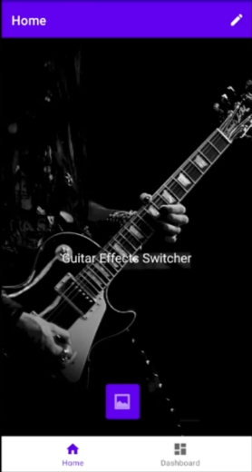
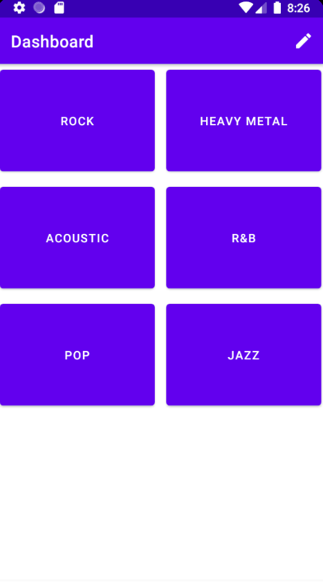
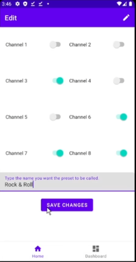
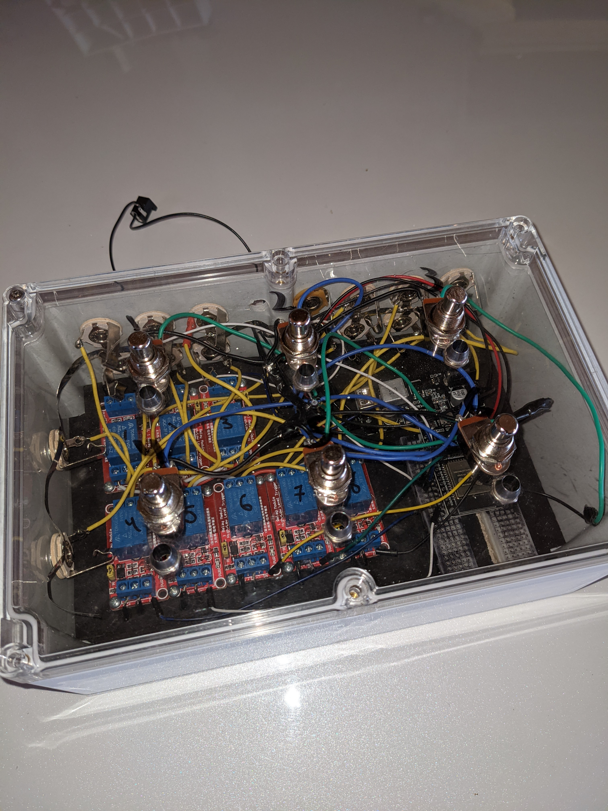
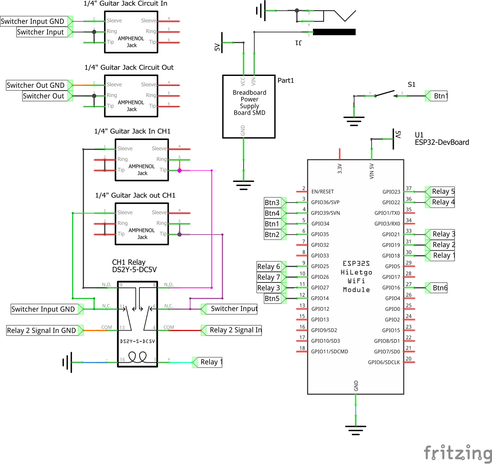

# CPS498-S21-Team04
### Guitar Synth Manager

> This Repo has been archived. It has been left public as it is from a class project in College.

# Table of Contents
* [Title](#CPS498-S21-Team04)
* [Introduction](#Introduction)

* [Objectives & Functionality](#Objectives-and-Functionality)

* [Snapshots](#Snapshots)
  * [Home Page](#Home-Page)
  * [Dashboard](#Dashboard)
  * [Editing Page](#Editing-Page)
  * [Prototype Housing](#Prototype-Housing)
  * [Prototype Schematic](#Prototype-Schematic)
* [Changes Needed to Design](#Changes-Needed-to-Design)
* [Team Contributions](#Team-Contributions)
* [Installation Guides](#Installation-Guides)
  * [Installing App to Android Device](#Installing-App-to-Android-Device)
  * [Uploading code to ESP-32](#Uploading-Code-to-ESP-32)

# Introduction:
The goals for the mobile application was to make an easy to navigate application for the end user to use whilst performing. We were able to work with Robert Wang on the design of the application so it was easy for an average person to navigate without much knowledge about technology. Also, we wanted to allow for more features in the future. The Room database allows for people to create more presets and have multiple pages of them if needed in the future. Through our discussions with Robert Wang he wanted to allow the users to be able to customize the application with a custom home image. Originally we were setting the image as a URI, but saving a URI into a Room Database was not supported. Also, you were not able to save the file location for the image because that would make the user have to allow all of the phone data to be accessed by the application at all times. So we had to get the Bitmap from the URI file and save into a bit array.

Hardware design has been updated, due to needing to handle the signal noise introduced from so many different ground sources being connected at once. Electrically on the circuitry it posed a problem in causing noticeable static in the housing that could and would trigger the relays seemingly at random. On the sound fidelity side of the circuitry, it introduced large amounts of noise from ground loops and static due to weak and loose connections. Any actual wires used will be replaced with fully insulated 16 gauge stranded wire, to ensure enough wire density to reduce loss of fidelity, and enough insulation to avoid static causing RF interference.

# Objectives and Functionality
The mobile application was developed in android studio for the Google Pixel 3. Inside the application we gave the user the ability to easily customize up to six presets by pressing the pencil icon up in the top right corner of the app. This will bring up a screen that shows each one of the presets that can be edited. From there we made it so the user just has to click on one of the presets in order to bring up the editing page where they could select which channels to turn on and off and give the preset a custom name. After that the user clicks the save changes button to save the information for that preset into the Room Database. Then that preset is ready to use by clicking on it in the dashboard page where it will send the state of the presets channels via Bluetooth. The user is also able to give the home screen a custom background by pressing the image button on the home page which will bring them to their photos on their phone and they would simply select the photo  they want to set as their background.

 Hardware prototyping was done via designing the schematic in the program Fritzeng, then building parts of the schematic to test functionality. (Testing the relay schematic for just one channel to prove the Microcontroller was able to reliably control the device). Once each component was functional, the built parts were put together, and slowly scaled up to reach full-size. At various points the schematic was placed into the housing to test if the enclosure introduced static or other forms of electrical variance to cause trouble. This wasn’t shown in an intense manner until channel 6 and 7 was inserted. This caused a need to scale down for recording a video, and redesigning the schematic around reducing the issues present in the full-scale design.

# Snapshots

## Home Page

The user is able to set a custom background image by simply pressing the image icon located at the bottom of the screen. This will then take them to their device/google images folders.

## Dashboard

The dashboard is a very simple design because it allows users to easily change which preset they are using. This allows guitarists to have minimum “misclicks” while performing on stage live. Once a preset is pressed, it sends the channel information which was set in the editing page to the Switcher through bluetooth.

## Editing Page

The editing page is used by the guitarist to easily be able to modify their presets for the effects they would like to be enabled. The user simply turns on the channels they would like on and are able to have a custom name.

## Prototype Housing

Snippet of Schematic showing the wiring diagram for each component, but saving space by not showing each iteration of the component. Only one button and one relay is shown, but each of those components are repeated 6 and 8 times respectively.

## Prototype Schematic

Photo of physical prototype used in final recording test, prior to discovery of need to redesign the relay system.

# Changes Needed to Design

The Hardware design needed reworking after discovery of how much noise and interference was in fact given from the ground loop issue. Changing the relay mechanism with a DPDT system solves the Ground Loop, but adds a significant number of wires in the system. Designing a PCB to utilize in the housing would enable reduction in wires utilized, thereby maintaining a higher-quality signal fidelity.

The software design is functional, but there are features that still need to be added. Adding a new way of editing presets by holding on the button on the dashboard. Adding a page that allows the user to see the device they are connected to via BlueTooth (Nav Menu for this created in bottom_nav_menu.xml and is currently commented out).

# Team Contributions
* Dominic Kenney
    * 150 Hours Worked
    * Worked on:
        * Hardware Schematic and Layout
        * Hardware Construction
        * Microcontroller Implementation
        * Microcontroller coding
            * Built Proof of Concept code for BT and hardware to test separately.
* Alex Gennero
    * 80 Hours Worked
    * Worked on:
        * Designed format of phone application
            * Worked with advisor to design app to be intuitive to musicians and non tech-savvy users
        * App navigation
            * Bottom Nav Bar
            * Editing Screen Popup Menu
        * Designed Room Database (Database Layer on an SQLite database)
            * String value for Preset Name
            * Boolean values for each channel
            * Byte Array for storing home page image
                * Image-to-URI to Byte Array
* Mitchell Murphy
    * 70 Hours Worked
    * Worked on:
        * Implemented Bluetooth functions for Mobile app
        * Implemented customizable home screen background.

# Installation Guides

## Installing App to Android Device
1. Ensure device has sidloading applications enabled
      1. Check in the Settings > Security > Unknown Sources checkbox.
1. Download the `.apk` file [here](/.apks/app-release.apk) to android device
1. Open downloads folder and tap on `.apk` file
      1. Tap yes when prompted to install application

## Uploading code to ESP-32
1. Enter the `Microcontroller Code` folder
1. choose which code you want to download by entering the corresponding sub-folder
1. Download the sub-folder as a `.zip` file
1. Extract `.zip` and enter the folder.
1. Open the `.ino` file in either Arduino IDE or Visual Studio Code
1. Select the corresponding ESP-32 board unit based on your hardware
      1. If not installed, please follow guide [here](https://randomnerdtutorials.com/installing-the-esp32-board-in-arduino-ide-windows-instructions/) to get the ESP-32 board manager installed for Arduino
1. Select the port the ESP-32 is connected to computer as
      1. `COM##` on Windows
      1. `/dev/cu.####` on Mac
      1. `/tty##` on Linux
1. Upload Code
      1. ESP-32's Boot button will need to be pressed when Code is being uploaded, in order for the connection to be made.
